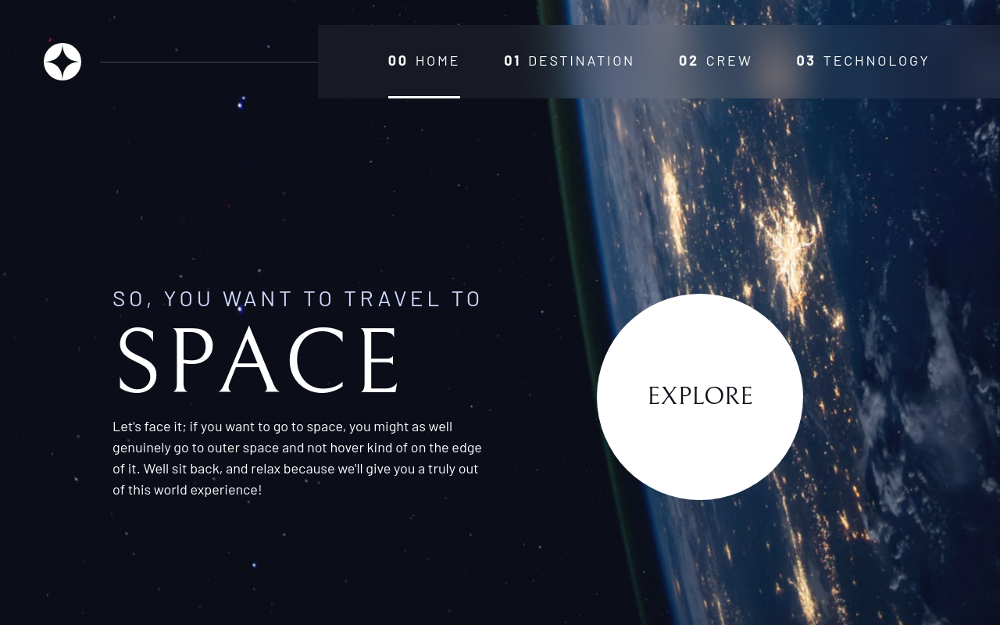

# Space and Tourism - Frontend Mentor Challenge

## Description

I successfully completed the Frontend Mentor challenge for the Space and Tourism responsive multipage website. This project showcases my proficiency in HTML, CSS, and JavaScript, utilizing modern techniques such as CSS Grid, Flexbox, utility classes, and JavaScript for tab navigation.

### Table of Contents

- [Installation](#installation)
- [Usage](#usage)
- [Technologies Used](#technologies-used)
- [Features](#features)
- [Project Structure](#project-structure)
- [Acknowledgements](#acknowledgements)
- [Credits](#credits)
- [License](#license)



## Installation

To run this project locally, follow these steps:

1. Clone the repository to your local machine.
    ```bash
    git clone https://github.com/m-ramzan786/Space-Tourism.git
    ```

2. Open the project folder in your code editor.

3. Open the `index.html` file in your web browser.

## Usage

Explore the Space and Tourism Website:

1. Open the [live demo](https://space-tourism-tau-indol.vercel.app/) or run it locally.

2. Navigate through the different pages and explore the fascinating content related to space and tourism.

## Technologies Used

- HTML
- CSS (including CSS Grid, Flexbox, Custom Properties)
- JavaScript
- Google Fonts

## Features

- **Custom Properties:** Defined for colors, font sizes, and families, adapting to different screen sizes.
- **Reset:** Applies a modern CSS reset for consistent styling across browsers.
- **Utility Classes:** Offers flexibility and consistency for styling, colors, and typography.
- **Components:**
  - *Large Button:* Custom-styled with a subtle hover effect.
  - *Header and Navigation:* Includes a logo, navigation links, and a responsive mobile toggle.
  - *Tab Navigation:* JavaScript-enabled for dynamic tab switching and user-friendly interactions.
- **Page-specific Backgrounds:** Unique images for different sections based on the page.
- **Layout:** Utilizes grid containers for responsive content structuring and adaptive typography.

## Project Structure

The project is organized into multiple pages, each featuring specific content related to space and tourism. The use of responsive design techniques ensures a seamless experience across various screen sizes.

## Acknowledgements

I would like to express my gratitude to Frontend Mentor for providing this challenging project, allowing me to enhance my skills and showcase my frontend development capabilities.

## Credits

I would like to acknowledge the following resources and tools that contributed to the success of this project:

- Frontend Mentor (Challenge Provider): [Frontend Mentor](https://www.frontendmentor.io/)

## Frontend Mentor Submission

This project was completed as a challenge from Frontend Mentor. You can view and rate the project on Frontend Mentor by following this [link](https://www.frontendmentor.io/solutions/responsive-landing-page-using-css-grid-and-flex-HIME4Mzbab).

## License

This project is licensed under the [MIT License](LICENSE). Feel free to use and modify the code as per the license terms.

---

## Badges


## Feedback and Contributions

If you have any feedback or would like to contribute to the project, follow these steps:

1. Fork the project.
2. Create a new branch for your contribution: `git checkout -b feature-name`.
3. Commit your changes: `git commit -m 'Add new feature'`.
4. Push to the branch: `git push origin feature-name`.
5. Open a pull request.

## Contact

If you have any questions, suggestions, or just want to connect, feel free to reach out:

- Email: [mramzanstv@gmail.com](mramzanstv@gmail.com)
- Portfolio: [Muhammad-Ramzan-Portfolio](https://your-portfolio.com)
- LinkedIn: [in/m-ramzan786](https://www.linkedin.com/in/m-ramzan786/)

## Tests

The project includes a set of tests to ensure the functionality is working as expected. To run the tests, use the following command:
```bash
npm test
